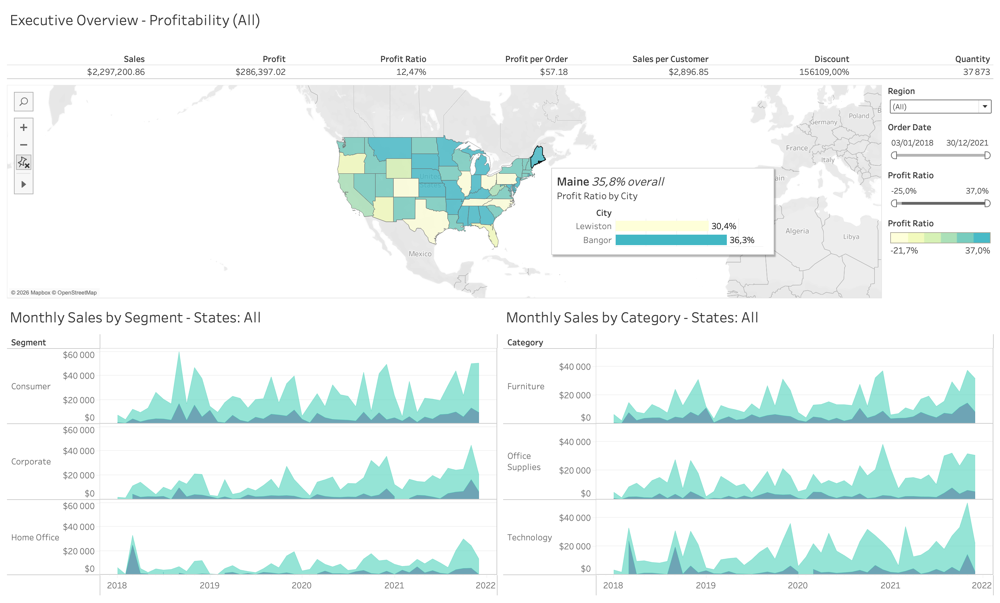
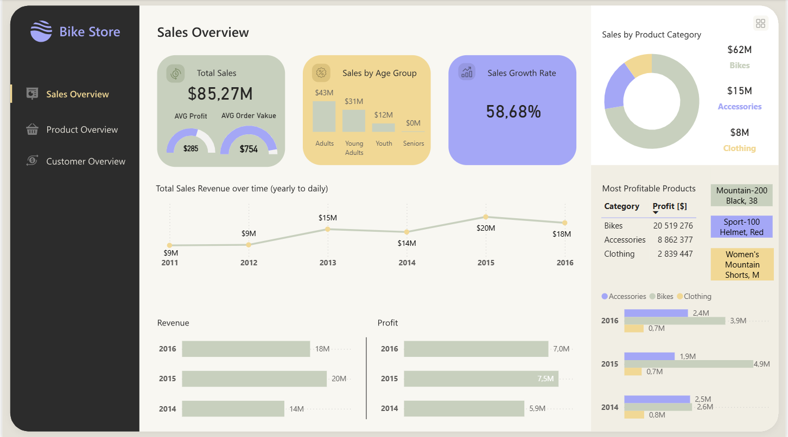
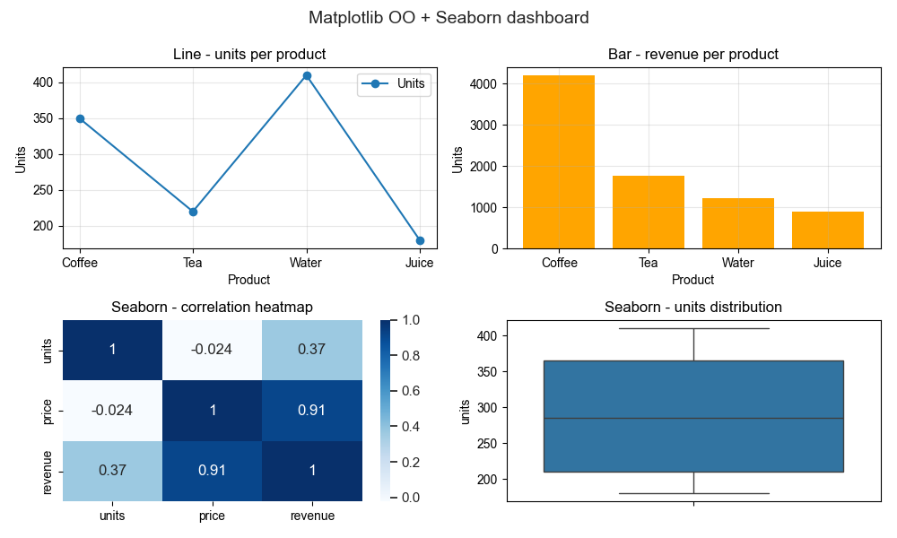
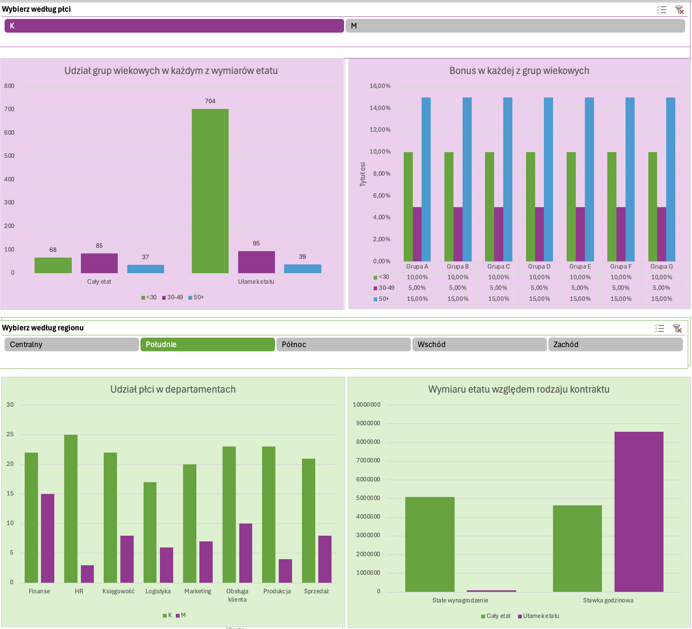

# data-analytics-playground 📊

A collection of exercises, notebooks, and mini-projects documenting my journey into data analytics.

This repository serves as a structured learning playground where each branch represents a specific topic or course. It allows me to organize my practice work, experiment with tools, and track my development as a data analyst.

Each branch focuses on a separate area, such as:

* SQL and database querying
* Data visualization
* Tableau
* Power BI
* Statistics fundamentals
* Excel and business analytics
* Python for data analysis
* Portfolio mini-projects

Additionally, the repository contains materials and exercises from selected online courses and workshops.

The goal of this project is continuous improvement, experimentation, and building a solid foundation in data analytics.

Tableau project:

Power BI project:

Python dashboard:

Excel dashboard:

